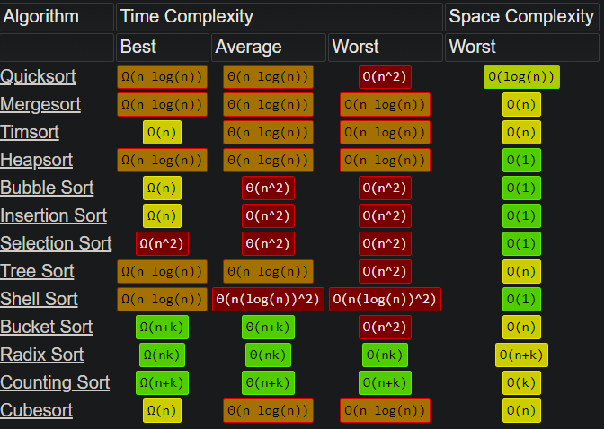
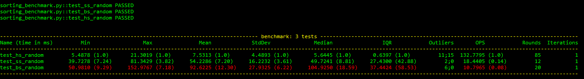
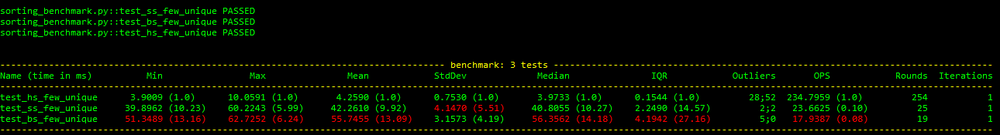
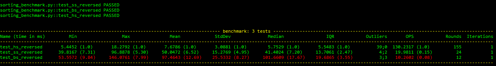
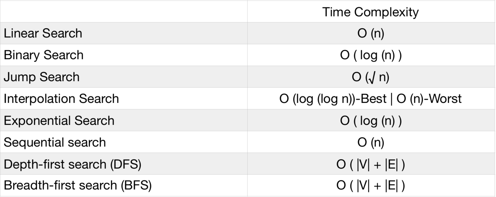
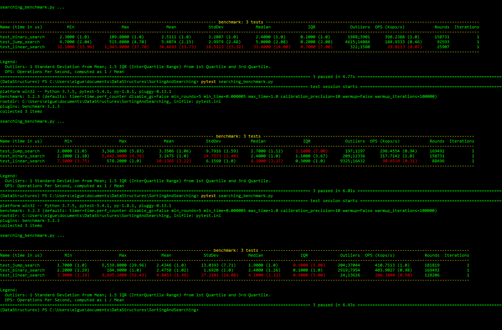

# Sorting & Searching 

## Sorting
Para nuestra discusión tendremos en cuenta solo selection sort (ss), bubble sort (bs) y heap sort (hs). Esta tabla nos enseña la complejidad de tiempo y memoria de cada uno de estos algoritmos. 

Los algoritmos se probaron con 3 tipos de inputs diferentes. 

### Random Input

### Few Unique Sorting

### Reversed Sorting

Los resultados de estos benchmarking son consistentes con la tabla para todos los inputs probados. En todos los casos Heap Sort es el mas rapido, seguido de Selection Sort y en ultimo lugar Bubble sort.

## Searching
Para nuestra discusión tendremos en cuenta los algoritmos de linear search, jump search y binary search. Esta tabla nos enseña la complejidad de tiempo. 

Para probar los algoritmos se utiliso una lista ya ordenada. Los resultados de el benchmark no fueron completamente consistentes al repetir el benchmark varias veces. 

Como podemos ver Linear search tiene semi-consistentemente los peores tiempos. Sin embargo, Binary Search y Jump Search se pelean por el pimer y segundo lugar.   